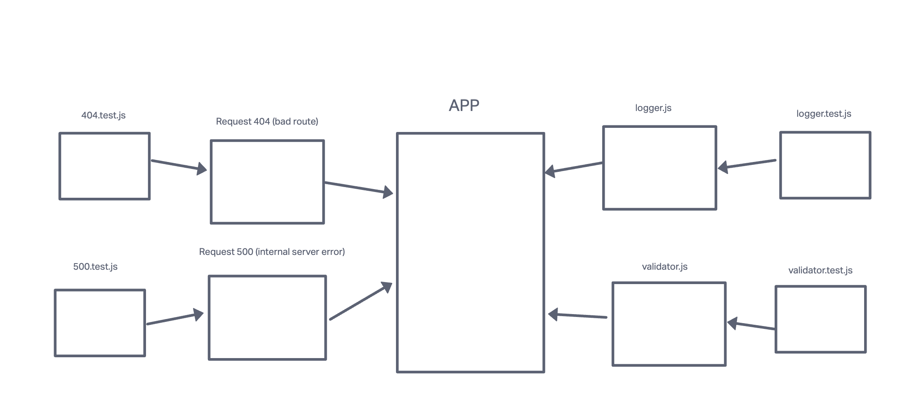

# Project Name: Basic Express Server

This project is a foundational Express.js server template that follows best practices in server modularization, middleware usage, and error handling. It includes routes to handle client requests, logging middleware to track incoming requests, and error handlers for both 404 and 500 responses. Additionally, it features thorough testing to ensure proper functionality, including handling missing query parameters and responding with appropriate status codes. This project serves as a solid starting point for building more complex Express.js applications.

[Deployed URL](https://basic-express-server-w9u0.onrender.com )

## UML

